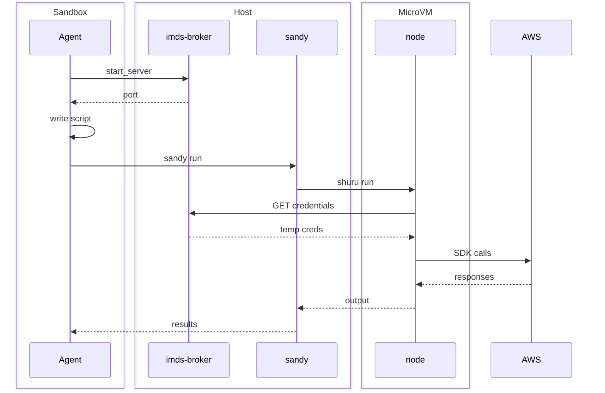

# Sandy

Sandboxed TypeScript execution for AWS queries using ephemeral microVMs.

Sandy is a [Claude Code](https://claude.ai/code) skill that runs TypeScript scripts inside disposable [Shuru](https://github.com/nicholasgasior/shuru) microVMs. Scripts get a pre-built Node.js environment with 150+ AWS SDK v3 service clients, and credentials are resolved via IMDS -- no static keys enter the VM.

## Why

AI agents that query AWS need SDK access but shouldn't get unrestricted shell access to the host. Sandy solves this by running each script in a fresh VM that:

- **Restricts network access** to AWS endpoints only (`*.amazonaws.com`, `*.aws.amazon.com`) — Shuru backend only; Docker does not support domain-based egress filtering
- **Blocks child processes** via Node.js `--permission` (no shelling out to AWS CLI or anything else)
- **Never sees static credentials** -- the AWS SDK resolves credentials through an IMDS server on the host
- **Is ephemeral** -- the VM is discarded after every run, leaving no persistent state

## How It Fits Together

The agent hosts both the sandy skill and the imds-broker MCP outside its own sandbox. To run a query, the agent starts an IMDS server via the MCP, then passes the server port and script path to the sandy skill. Sandy launches a Shuru VM with the script mounted, and the VM's AWS SDK fetches credentials from the IMDS server to talk to AWS.



**Boundaries:**
- The **agent sandbox** restricts filesystem access, network egress, and command execution. The agent can write scripts and read results but cannot access `~/.aws` or call AWS directly.
- The **sandy skill and imds-broker MCP** are hosted by the agent but run **outside the sandbox**. Sandy needs host access to invoke Shuru; the MCP serves credentials via IMDS on localhost.
- The **Shuru microVM** is ephemeral and isolated. Network is restricted to AWS endpoints, `child_process` is blocked by Node's permission model, and the VM is discarded after each run. Credentials are fetched via IMDS and never written to disk.

## Prerequisites

- [Shuru](https://github.com/nicholasgasior/shuru) -- ephemeral microVM manager (arm64 Linux VMs on macOS)
- [Claude Code](https://claude.ai/code) -- Sandy is installed as a Claude Code skill/plugin
- [imds-broker](https://github.com/jamestelfer/imds-broker) MCP -- serves AWS credentials via IMDS on the host

## Configuration

Sandy works best when Claude Code is running in sandbox mode. The recommended `settings.local.json`:

```json
{
  "permissions": {
    "allow": [
      "Bash(/full/path/to/isolate/skills/sandy/scripts/sandy:*)"
    ],
    "deny": []
  },
  "sandbox": {
    "enabled": true,
    "autoAllowBashIfSandboxed": true,
    "excludedCommands": [
      "${CLAUDE_SKILL_DIR}/scripts/sandy *"
    ]
  }
}
```

> **Note:** `permissions.allow` requires the full absolute path to the `sandy` script -- `${CLAUDE_SKILL_DIR}` is not expanded in permission statements. `excludedCommands` does support the variable.

What this does:

- **`sandbox.enabled: true`** -- the agent runs inside Claude Code's sandbox, restricting filesystem and network access. The agent can write scripts and read results, but cannot reach AWS or `~/.aws` directly.
- **`sandbox.excludedCommands`** -- the `sandy` script itself must run _outside_ the sandbox. It needs host access to invoke Shuru, mount directories, and manage snapshots.
- **`permissions.allow`** -- auto-approves all `sandy` subcommands so the agent doesn't prompt on every run. Must use the full path to the script.
- **`sandbox.autoAllowBashIfSandboxed`** -- lets the sandboxed agent run bash commands freely (they're already restricted by the sandbox).

### Network egress

With the sandbox enabled, the agent's own network access is restricted by Claude Code. The only path to AWS is through Sandy's VM, which further restricts egress to `*.amazonaws.com` and `*.aws.amazon.com`.

### Credential isolation

The sandbox should deny access to `~/.aws` so the agent cannot read AWS credentials, profiles, or configuration files directly. Credentials flow exclusively through the imds-broker MCP into the Shuru VM via IMDS.

## Setup

Create the VM snapshot (one-time, or after changing bootstrap dependencies):

```bash
sandy snapshot create
```

This downloads Node.js 24, installs pnpm, and runs `pnpm install` for all AWS SDK clients and utility libraries inside the VM. The resulting snapshot is used as the base for all future runs.

Verify the environment:

```bash
# Check packages and file I/O (no AWS credentials needed)
sandy check baseline

# Check AWS connectivity (requires an IMDS port)
sandy check connect --imds-port <port>
```

Both commands exit 0 and print a table on success.

## Usage

```bash
sandy run \
  --imds-port <port> \
  --script path/to/script.ts \
  --session <id> \
  -- [args...]
```

| Flag | Required | Description |
|------|----------|-------------|
| `--imds-port <port>` | Yes | IMDS server port on the host |
| `--script <path>` | Yes | Path to TypeScript file |
| `--region <region>` | No | AWS region (default: `us-west-2`) |
| `--session <id>` | No | Session ID for grouping output |
| `--output-dir <dir>` | No | Override host output directory |
| `-- [args...]` | No | Arguments passed to the script via `process.argv` |

### What happens on `sandy run`

1. The script directory is mounted read-only into the VM at `/workspace/scripts/`
2. `tsc` type-checks all TypeScript files -- type errors stop execution before any AWS calls
3. `node --permission` runs the compiled JavaScript with filesystem access but no child processes
4. The AWS SDK resolves credentials via IMDS at `http://10.0.0.1:<port>`
5. Output written to `process.env.SANDY_OUTPUT` is synced back to `.sandy/<session>/` on the host

## Writing Scripts

Scripts are standard TypeScript with access to all `@aws-sdk/client-*` packages and several utility libraries (`arquero`, `asciichart`, `console-table-printer`, `@fast-csv/format`, `jmespath`).

### Async generators for AWS iteration

All paginated AWS calls must use `async function*` generators. This ensures progress is visible immediately, partial results survive failures, and callers control iteration.

```typescript
import { ECSClient, ListServicesCommand } from "@aws-sdk/client-ecs";

const ecs = new ECSClient({ region: process.env.AWS_REGION });

async function* listServiceArns(cluster: string): AsyncGenerator<string[]> {
  let nextToken: string | undefined;
  do {
    const resp = await ecs.send(
      new ListServicesCommand({ cluster, nextToken })
    );
    const arns = resp.serviceArns ?? [];
    if (arns.length > 0) yield arns;
    nextToken = resp.nextToken;
  } while (nextToken);
}

for await (const batch of listServiceArns("my-cluster")) {
  console.log(`Got ${batch.length} services`);
}
```

### Environment

| Variable | Value |
|----------|-------|
| `AWS_REGION` | Set via `--region` flag |
| `SANDY_OUTPUT` | `/workspace/output` (write results here) |
| Working directory | `/workspace` |

### Constraints

- **No `child_process`** -- `execSync`, `spawn`, `exec` all fail at runtime. Use SDK clients directly.
- **No outbound network** except AWS endpoints (Shuru backend). Fetching `example.com` or any non-AWS host will fail. The Docker backend does not enforce this restriction — prefer Shuru for untrusted scripts.
- **No persistent state** between runs. Each run starts from a clean snapshot.

## Snapshot Management

```bash
sandy snapshot create   # Build the VM snapshot
sandy snapshot list     # List available Shuru checkpoints
sandy snapshot delete   # Remove the sandy snapshot
```

Recreate the snapshot after modifying `scripts/bootstrap/package.json` or `scripts/bootstrap/init.sh`.

## Project Structure

```
.claude-plugin/
  marketplace.json          # Claude plugin marketplace registration
isolate/
  .claude-plugin/
    plugin.json             # Plugin metadata (version, description)
  skills/sandy/
    SKILL.md                # Skill documentation (shown to Claude Code)
    scripts/
      sandy                 # Main orchestration script (Bash)
      bootstrap/
        init.sh             # VM initialization (Node.js, pnpm, deps)
        package.json        # AWS SDK clients + utility libraries
        tsconfig.json       # TypeScript compiler config
      checks/
        baseline.ts         # Package & file I/O verification
        connect.ts          # AWS IMDS connectivity verification
    resources/
      examples.md           # Example script documentation
      examples/
        ec2_describe.ts     # EC2 instance lookup by tag
        ecs_services.ts     # ECS service enumeration
```

## License

Apache 2.0 -- see [LICENSE](LICENSE).
